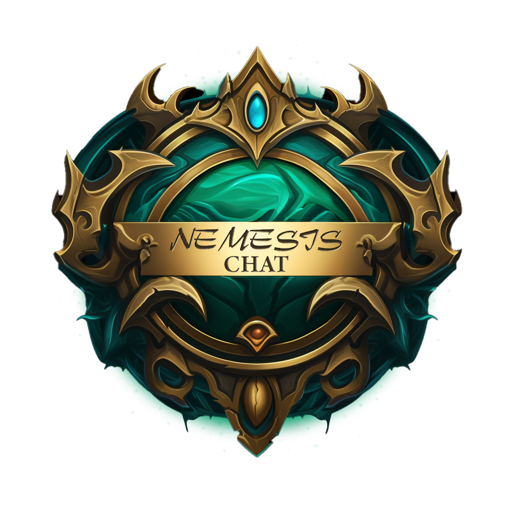

# Heads up!

Nemesis Chat is changing dramatically and this documentation is partially incorrect. This document will be updated with future refactors, but do keep in mind that in the meantime some inaccuracies will inevitably exist.

# Index

- [Basic Flow](#basic-flow)
    - [Step 1: An event fires](#step-1-an-event-fires)
    - [Step 2: Proper objects are hydrated](#step-2-proper-objects-are-hydrated)
        - [All Events](#all-events)
        - [M+ Dungeon Start](#m-dungeon-start)
        - [M+ Dungeon End](#m-dungeon-end)
        - [Boss Fight Start](#boss-fight-start)
        - [Boss Fight End](#boss-fight-end)
        - [Combat Start](#combat-start)
        - [Combat End](#combat-end)
        - [NCSegment](#ncsegment)
    - [Step 3: Message is populated](#step-3-message-is-populated)
    - [Step 4: String replacement and message sending](#step-4-string-replacement-and-message-sending)
- [General Concepts](#general-concepts)
    - [Efficiency](#efficiency)
        - [Events](#events)
        - [Logic Flow](#logic-flow)
    - [Extensibility](#extensibility)
        - [Core](#core)
        - [UI / Configuration](#ui--configuration)
        - [APIs](#apis)
- [Contributing](#contributing)

# Basic Flow

Nemesis Chat works in a fairly simple manner from a high level. However, the intricacies can be somewhat daunting and complex due to the layers of abstraction.

## Step 1: An event fires

The first line in every event: `NCEvent:Reset()` is called, which initializes ephemeral objects for later reference. This will entirely wipe `NCEvent`, `NCSpell`, and `NCController` for each and every event. Bottom line, these objects cannot be referenced from event to event; rather, they are **only** available for one event fire.

## Step 2: Proper objects are hydrated

### All Events:

`NCEvent` is initialized with the following:

```
ncEvent = {
    category = "",
    event = "",
    target = "SELF",
    nemesis = "",
    bystander = "",
},
```

`NCController` is initialized with the following:

```
NCController = {
    channel = "SAY",
    message = "",
    target = "",
    customReplacements = {},
},
```

`NCSpell` is initialized with the following:

```
ncSpell = {
    active = false,
    source = "",
    target = "",
    spellId = 0,
    spellName = "",
    extraSpellId = 0,
},
```

---

All of the models below inherit from `NCSegment`, which is a model designed for a particular time segment. More information on this particular model can be found below the overview of its children. It is recommended to review the model itself before modifying any children.

### M+ Dungeon Start:

On start, `NCDungeon` will be hydrated with the following properties:

```
{
    identifier: <name of dungeon>,
    active: true,
    level: <level of M+ dungeon>,
    startTime: <timestamp>,
    completeTime: 0,
    totalTime: 0,
    complete: false,
    success: false,
}
```

---

### M+ Dungeon End:

On end, `NCDungeon` will be updated / hydrated with the following properties:

```
{
    active: false,
    level: <level of M+ dungeon>,
    completeTime: <timestamp of end>,
    totalTime: <end - start>,
    complete: true,
    success: <true/false>,
    [...]
}
```

*`[...]` denotes properties which are neither updated nor hydrated in `END` events. They **may** not be available in the event of `PLAYER_ENTERING_WORLD` scoped ephemeral data.*

---

### Boss Fight Start:

On start, `NCBoss` will be hydrated with the following properties:

```
{
    identifier: <name of boss>,
    active = true,
    startTime = <timestamp>,
    name = <boss name>,
    complete = false,
    success = false,
}
```

---

### Boss Fight End:

On end, `NCBoss` will be updated / hydrated with the following properties:

```
{
    active = false,
    [...]
    complete = true,
    success = <true/false>,
}
```

*`[...]` denotes properties which are neither updated nor hydrated in `END` events. They **may** not be available in the event of `PLAYER_ENTERING_WORLD` scoped ephemeral data.*

---

### Combat Start:

On combat start, `NCCombat` will be hydrated with the following properties:

```
{
    activate = true,
},
```

Each time an interrupt fires or avoidable damage is taken (assuming GTFO is installed and the option is enabled in NC), the above tables will be updated. NCDungeon will also be updated. This allows messages to fire based on leaving combat, and finishing a Mythic+ Dungeon.

---

### Combat End:

On combat end, `active` is updated to `false`. Data will not be wiped until a new combat start event fires.

---

### NCSegment:

This object is a base object, meant to be inherited by any objects which would be used for the purpose of tracking a particular segment. It provides the vast majority of tracking methods and variables used by the above models, and as such, it is often updated with new logic as opposed to updating children. It currently tracks per-player:

- Affixes
- Avoidable Damage
- Deaths
- Heals
- Interrupts
- Kills
- Offheals
- Pulls
- Rankings (`NCRankings`)

It also tracks every segment which inherits from it, which allows updating all active segments with global methods. This makes it incredibly easy to instantiate a new segment and ensure it is properly hydrated + updated. The main logic that a child is responsible for, is ensuring that `active` is explicitly set when required (via `:Start()` or `:Reset()`), and what happens upon starting / finishing the segment (via `:StartCallback()` and `:FinishCallback()`).

## Step 3: Message is populated

### Core

First, we check for at least one configured message matching the Category, Event, and Target. If so, we check all conditions, and if there are multiple matches, we pick one of them at random. We then set the chosen string to `NCController.message`.

Then we check if AI messages are enabled. If so, and `NCController.message` is not populated, we attempt to set `NCController.message` with an AI message's string. Currently, NC only supports taunts, but positive messages are defined and will be released soon.

The flow of message retrieval is as follows:

```
Category -> Event -> Target
```

Where:

- `Category` may be `BOSS`, `COMBATLOG`, `GROUP`, or `CHALLENGE`.
- `Event` may be `SUCCESS`, `FAIL`, `DEATH`, etc.
- `Target` may be `SELF`, `NEMESIS`, or `BYSTANDER`.

This flow in mind, the end result looks something like this:

```
core.db.profile.messages["BOSS"]["DEATH"]["NEMESIS"]
```

The above example would retrieve a player-configured message for a nemesis dying in a boss encounter.

## Step 4: String replacement and message sending

Finally, we'll take all core and custom replacement strings, and replace them with appropriate values within the game.

NC will check to ensure we're not spamming -- there is a hardcoded minimum of 1 second between all messages. There is also a configurable property allowing a user to set the minimum time between messages as they choose. The hardcoded minimum of 1 second will **always** take precedence.

NC will check to ensure that the player is not in combat if `Non-Combat Only` mode is enabled. This prevents messaging during combat, which means all messages will be discarded if the player is currently in combat. One exception to this is beginning a boss fight, as that event only fires upon entering combat with said boss.

NC will do a quick check to ensure we send the message to the appropriate channel, validate that we do in fact have the proper data (such as `NCController.message`, `NCEvent.nemesis`, etc), and send the message.

# General Concepts

## Efficiency

### Events
---

NC tries to be intelligent with what it subscribes to in regards to in-game events. If we're not in a party, we unsubscribe from everything other than `PLAYER_ENTERING_WORLD` and `GROUP_ROSTER_UPDATE`. With those two events, NC will check if it should subscribe to other events or not.

### Logic Flow
---

NC attempts to avoid unnecessary memory bloat with ephemeral objects. This pattern also allows for easier, cleaner logic within event handling. The core ephemeral objects are:

- `NCEvent`: This will initialize on every event. It holds crucial data in regards to what the event **actually is**. Because our events can come from **many** sources (combat event log, encounter start, challenge start, etc), this object allows us to normalize the flow across the board.
- `NCSpell`: This will initialize on every event. It holds data specifically purposed for spell events, such as interrupts and feasts.
- `NCController`: This will initialize on every event. It holds data specifically purposed for sending messages in-game. It is responsible for sending the message once upstream logic (`NCEvent` and `NCSpell`) has determined where to retrieve the message.
- `NCDungeon`: This will initialize upon starting a Mythic + dungeon and on any event which triggers the `PLAYER_ENTERING_WORLD` event. It holds data specifically purposed for M+ dungeons, including its own kill count and death count.
- `NCBoss`: This will initialize upon starting a boss fight and on any event which triggers the `PLAYER_ENTERING_WORLD` event. It holds data specifically purposed for boss fights.
- `NCCombat`: This will initialize upon entering combat. It holds data specifically purposed for combat segments, like interrupts and avoidable damage.

These objects encompass virtually all Nemesis Chat logic. Events themselves will simply either call helper methods within these objects, or set properties on these objects. In any case, events will not contain logic, but rather normalize data for hydration and processing on/within these objects.

This pattern keeps all events very clean, and allows a quick glance to easily convey logic that is taking place.

**Quick Note**: These objects are *not* designed to be accessible to any other addons. If there is an interest in interacting with NC via other addons, I'd be happy to build an API. It just seems so incredibly niche that I passed on building anything like that. One use-case that I could see being helpful is offering global replacement strings / values. This may be developed just in case there's interest.

## Extensibility

NC has undergone multiple rewrites from the ground up. From idea, to POC, to what is currently in place now; many different concepts and patterns were explored. That said, it's certainly not perfect and there are many things I did not consider when building this addon.

### Core

The core codebase should be extremely flexible to fork and expand upon. If you need more properties within `core.NCBoss` for example, you may simply edit it within `Init.lua`: `core.runtimeDefaults.ncBoss`. Every time this object is instantiated, it will use `core.runtimeDefaults` to do so. This is the same for every other core object.

### UI / Configuration

The configuration screen is, however, less flexible. It has proven to be a challenge to allow flexibility within the configuration screen, while simultaneously maintaining congruency within the core logic.

For example, available events: Feasts are 100% custom logic, in which we simply check if a player within the party cast a spell whose id is found within `core.feastIDs`. That in mind, representing this on versatile-yet-easy UI can be challenging. It is a delicate dance offering configurability *and* an easy-to-use interface.

WeakAuras tends to lean into configurability and versatility, but still maintains a fairly easy-to-grasp UI/UX. NemesisChat currently leans opposite: A much easier interface with (for better or worse) less configurability / versatility. There is no opposition to more versatility, however, it should be widely understandable when configuring.

However, some things are pretty easy and scalable. Adding new conditions is as easy as tossing them into the `core.messageConditions` object in `Init.lua`. They'll immediately appear in the configuration screen. The only other dependency would be creating the function matching the condition's value. These functions live in `NemesisChatMessage.lua`, near the end of the file, under `NCController.Condition`. For example, the condition for checking the Nemesis's role has a value of `NEMESIS_ROLE`. Inside `NCController.Condition`, you'll notice `["NEMESIS_ROLE"] = function() [...]` This function simply retrieves the name of the nemesis. Any new conditions will need to follow this same pattern.

Overall, a good number of changes would likely only take a few minutes after gaining familiarity with the codebase. I've tried to keep things as painless as possible for extension, but there are (sadly) still a few relics that will be rewritten in the future.

### APIs

APIs are extremely easy to tie in with the `NemesisChatAPI` model. There are two examples in the code already, but we will focus on the Details! API:

First, we call `NemesisChatAPI:AddAPI("NC_DETAILS", "Details! API")`, which will return the newly created API. This newly created API will also have helper functions available on it, and will allow us to chain method calls. Immediately following the instantiation of the API, we chain on several methods:

```
:AddConfigOption({
    label = "Details! API",
    value = "ENABLED", -- This will read in config options as NCDETAILS_ENABLED
    description = "Enable the Details! API for use in messages.",
    primary = true,
})
```

This adds a configuration toggle to Nemesis Chat's `General->APIs` section. Under the hood, it will reference/set `core.db.profile.APIS["NC_DETAILS"].NC_DETAILS_ENABLED` for this toggle. It can be checked / referenced / set at any time. The `primary` property allows this to function as the toggle for enabling / disabling the API. If multiple config toggles are set with `primary = true`, unexpected results will ensue. ONLY set this to `true` for the primary enable/disable toggle for the API.

```
:AddCompatibilityCheck({
    configCheck = false,
    exec = function()
        if Details == nil then
            return false, "Details! is not installed."
        end

        return true, nil
    end
})
```

This method call is adding a compatibility check which will be run in core logic to ensure everything works as intended. The `configCheck` property allows for different checks to be performed at different times. Setting it to `false` ensures that we can perform this check when toggling the above added configuration toggle. Setting it to `true` would cause this to be ignored when toggling the config option. Here is an example of that:

```
:AddCompatibilityCheck({
    configCheck = true,
    exec = function()
        if not core.db.profile.API["NC_DETAILS" .. NemesisChatAPI:GetAPI("NC_DETAILS").configOptions[1].value] then
            return false, "Details! API is not enabled."
        end

        return true, nil
    end
})
```

This compability check will not run when toggling config options, as it checks if the API is enabled. This will only be run in core logic.

```
:AddSubject({
    label = "Nem. DPS (Current)",
    value = "NEMESIS_DPS",
    exec = function() return NCDetailsAPI:GetDPS(NCEvent:GetNemesis(), DETAILS_SEGMENTID_CURRENT) end,
    operators = core.constants.NUMERIC_OPERATORS,
    type = "NUMBER",
})
```

This method call is adding a new subject to conditions labeled `Nem. DPS (Current)`. The `exec` property is a function which will retrieve the value immediately prior to comparison. You may add any operators you want, but they must follow the standardized operators structure. Here, we just want our `NUMERIC_OPERATORS`, which are for comparing numeric values.

```
:AddReplacement({
    label = "Nemesis DPS",
    value = "NEMESISDPS",
    exec = function() return NemesisChat:FormatNumber(NCDetailsAPI:GetDPS(NCEvent:GetNemesis(), DETAILS_SEGMENTID_CURRENT)) end,
    description = "The DPS of the Nemesis for the current fight.",
    isNumeric = true,
})
```

This method call is adding a text replacement tag. The `label` and `description` properties will be used in the Reference section of the configuration screen -- if they are not set, they will not be presented in the Reference section. The `value` property defines the tag -- in this example, the tag will be `[NEMESISDPS]` (**do not** include the square brackets!). Like the previous example, `exec` is a function which will be used to pull the proper value for messages. `isNumeric` will allow this replacement tag to be used in numeric comparisons -- if it is false, it will be treated as a non-numeric value and will throw an error if used in a numeric conparison. For comparisons, we override the comparison with a non-formatted (`3600` instead of `3.6k` for example) value for obvious reasons. You can see that below:

```
:AddReplacement({
    value = "NEMESISDPS_CONDITION",
    exec = function() return NCDetailsAPI:GetDPS(NCEvent:GetNemesis(), DETAILS_SEGMENTID_CURRENT) end,
})
```

This is another replacement, and it is for the same thing. However, it is not formatted, has no `label` or `description`, and the value is `NEMESISDPS_CONDITION`. Nemesis Chat will first look for tags with `_CONDITION` appended for all comparisons, allowing an easy differentiation between what could go in messages (`141.23K DPS`) versus what could be compared in conditions (`141236`).

Instantiating an API is possible in other addons, but was not tested / vetted. If you do instantiate an API, it is required to call the following method after all logic:

```
NemesisChatAPI:SetAPIConfigOptions()
```

This method populates all config options, including reference text and condition subjects. If it is not called, you will not see config options, reference text, or condition subjects. If it is called too early, you will see varying results. It should only be called once as it is fairly heavy, and should only be called after all data is set on the API.

If you only add replacements, this call is not necessary and should not be used due to it being heavy. Replacements are pulled in per-message, and the login defined in `exec` will only be ran if the replacement tag is used within a message.

# Contributing

If you'd like to contribute, please note that PRs will not be approved unless they are clean. These are the general rules for submitting a PR:

1. **Follow existing patterns or replace them with something better.**
   - If your PR extends NC to support other spellcasts, for example, make sure you hydrate `NCSpell`, and properly leverage the existing objects while respecting the overall flow.
   - If your PR simply adds more events to capitalize on, make sure you follow the existing patterns and general flow. One-offs, hardcoded values (which can be avoided), and generally sloppy code will not be approved.
   - If your PR rewrites the entire flow and I can't understand what is going on, I'm likely going to deny it. It should be fairly obvious what the code is doing in the vast majority of circumstances.
2. **Spam is bad.**
   - If your PR appears to add something which could be abused, you will be asked to add safeguards. For example, if you add a feature for random banter on an interval, that interval can never be too low. The configuration should disallow low values, and your code should check for edge cases.
   - If your PR is outright abuse, it will be denied. The purpose of this addon is to spice up friendly groups with banter. Frankly, I made this to talk smack on a good friend. I did not make this to facilitate outright harrassment or abuse.
2. **Account for the future.**
   - Who knows where NC will go (if anywhere). However, code should always allow for future eyes to easily follow logic.
   - Code should never pigeon-hole future devs into weird patterns which they must fight against. Everything implemented should empower and enable future developers.

   Beyond that, just know that each PR will be reviewed on a case-by-case basis. Your interest is very much welcomed, and I look forward to potentially working with you!
